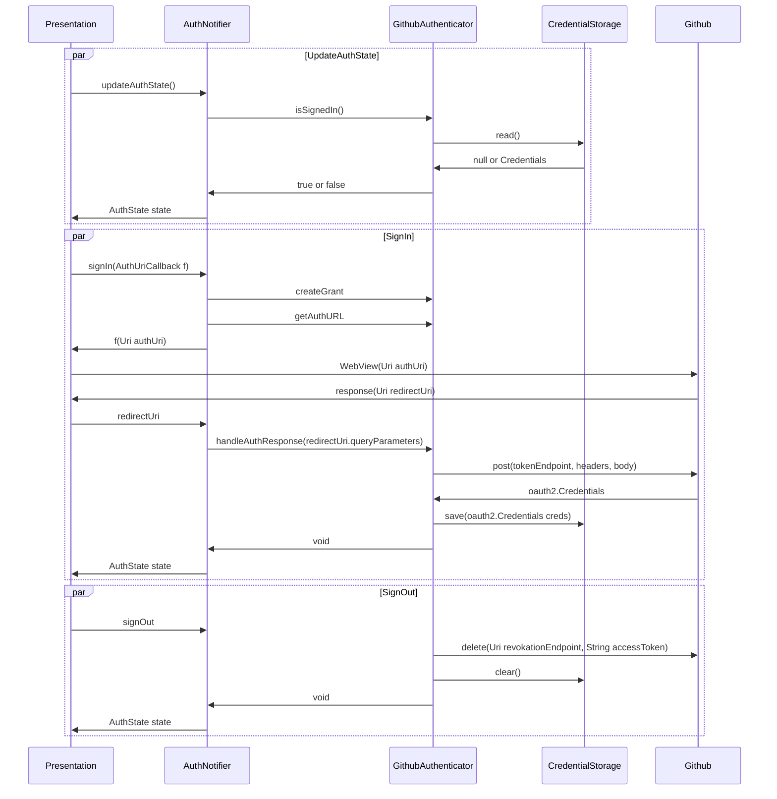

```mermaid
sequenceDiagram
par UpdateAuthState
	Presentation->>AuthNotifier: updateAuthState()
	AuthNotifier->>GithubAuthenticator: isSignedIn()
	GithubAuthenticator->>CredentialStorage: read()
	CredentialStorage->>GithubAuthenticator: null or Credentials
	GithubAuthenticator->>AuthNotifier: true or false
	AuthNotifier->>Presentation: AuthState state
end

par SignIn
	Presentation->>AuthNotifier: signIn(AuthUriCallback f)
	AuthNotifier->>GithubAuthenticator: createGrant
	AuthNotifier->>GithubAuthenticator: getAuthURL
	AuthNotifier->>Presentation: f(Uri authUri)

	Presentation->>Github: WebView(Uri authUri)
	Github->>Presentation: response(Uri redirectUri)
	Presentation->>AuthNotifier: redirectUri

	AuthNotifier->>GithubAuthenticator: handleAuthResponse(redirectUri.queryParameters)
	GithubAuthenticator->>Github: post(tokenEndpoint, headers, body)
	Github->>GithubAuthenticator: oauth2.Credentials
	GithubAuthenticator->>CredentialStorage: save(oauth2.Credentials creds)
	GithubAuthenticator->>AuthNotifier: void
	AuthNotifier->>Presentation: AuthState state
end

par SignOut
	Presentation->>AuthNotifier: signOut
	GithubAuthenticator->>Github: delete(Uri revokationEndpoint, String accessToken)
	GithubAuthenticator->>CredentialStorage: clear()
	GithubAuthenticator->>AuthNotifier: void
	AuthNotifier->>Presentation: AuthState state
end
```
